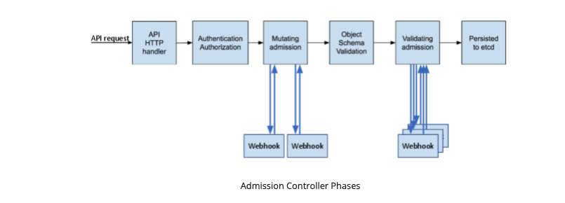

# Admission Controllers

An Admission Controller is a piece of code that listens to requests to the API Server (prior to execution but after AuthN and AuthZ). The list of active Admission Controllers compiled into the `kube-apiserver` is [here](https://kubernetes.io/docs/reference/access-authn-authz/admission-controllers/#what-does-each-admission-controller-do). These controllers can be set via flags when starting the `kube-apiserver`.

Admissions Controllers can be validating, mutating, or both. They limit requests to create, delete, modify objects, or connect to proxy. They cannot limit requests to read objects. Requests to the api server to read objects are not subject to admission control.

The Admission Control process occurs in two phases:

*Note: some controllers can be both mutating and validating*

- First Phase: mutating webhooks are run
- Second Phase: validating webhooks are run

If any controller within the two phases rejects a request a request, the entire request is rejected immediately and an error is returned

Within the list of Admission Controllers, there are two special controllers: `MutatingAdmissionWebhook` and `ValidatingAdmissionWebhook`.

- Mutating Controllers can modify the requesting object.
- Validating Controllers can only validate the request.

Admission Controller can produce side effects to related objects as a part of object mutation. The example used in the documentation is incrementing quota usage of why side effects may be warranted. Any side effects need a corresponding reclamation or reconciliation process because any single controller will not know whether a request passes all other admission controller checks.

## Why Admission Controllers?

The documentation cites advanced features of Kubernetes requiring the use of Admission Controllers. However, a more concrete example might be policy enforcement or mutating config inflight to ensure proper labels and annotations are applied.

## Developing an Admission Controller

Here we pick up with a new set of documentation: [A Guide to Kubernetes Admission Controllers](https://kubernetes.io/blog/2019/03/21/a-guide-to-kubernetes-admission-controllers/) and the awesome companion demo [here](https://github.com/stackrox/admission-controller-webhook-demo)
